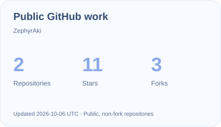
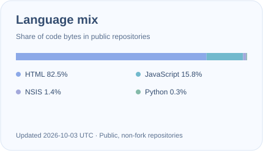

**English · [简体中文](README.zh-CN.md)**

### Hi, I'm Zephyr 👋

**Software Technology Student · Developer · Curious Builder**

 

**[Blog](https://zephyraki.online) · [Projects](#selected-work) · [Tech Stack](#tech-stack) · [Activity](#github-activity)**

 

## About me

I'm **Zephyr**, a software technology student who enjoys turning ideas into working software.

I explore application development, self-hosted services, and AI tools — from Java and Android to Linux, deployment, and automation. I learn best by building something, understanding how it works, and improving it along the way.

- 🛠️ Maintaining **Mineradio for macOS**, an unofficial port of the original project.
- 🌐 Building my personal home on the web at **[zephyraki.online](https://zephyraki.online)**.
- 🤖 Exploring **MCP, AI agents, and practical automation**.
- 🌱 Learning **Java / Spring, Android, database design, and backend architecture**.

> Make it work. Understand why it works. Then make it better.

 

## Selected work

<table>
<tr>
<td width="50%" valign="top">

### 🎵 [Mineradio · macOS](https://github.com/ZephyrAki/Mineradio-macOS)

An unofficial macOS port and maintained edition of Mineradio. Working on packaging, desktop integration, and an immersive music experience.

`Electron` `JavaScript` `macOS`

[Explore the repository →](https://github.com/ZephyrAki/Mineradio-macOS)

</td>
<td width="50%" valign="top">

### ☁️ [Zephyr Blog](https://zephyraki.online)

My personal space for development notes, experiments, and things I learn. Built around a self-hosted WordPress environment.

`WordPress` `Linux` `Nginx`

[Visit the blog →](https://zephyraki.online)

</td>
</tr>
<tr>
<td width="50%" valign="top">

### 🤖 AI & MCP

Exploring how agents connect to custom tools and external services, and how automation can make everyday workflows more useful.

`Python` `MCP` `AI Agents`

</td>
<td width="50%" valign="top">

### 🖥️ Server & application lab

A place to learn by doing: Linux services, deployment, Java backends, Android applications, and database design.

`Java` `Android` `Linux` `SQLite`

</td>
</tr>
</table>

 

## Tech stack

Tools I use and technologies I'm learning.

**Languages**

<picture>
  <source media="(prefers-color-scheme: dark)" srcset="assets/languages-dark.svg" />
  
</picture>

**Development**

<picture>
  <source media="(prefers-color-scheme: dark)" srcset="assets/development-dark.svg" />
  
</picture>

**Data & infrastructure**

<picture>
  <source media="(prefers-color-scheme: dark)" srcset="assets/infrastructure-dark.svg" />
  
</picture>

**Tools**

<picture>
  <source media="(prefers-color-scheme: dark)" srcset="assets/tools-dark.svg" />
  
</picture>

 

## GitHub activity

<picture>
  <source media="(prefers-color-scheme: dark)" srcset="assets/stats-dark.svg" />
  
</picture>
<picture>
  <source media="(prefers-color-scheme: dark)" srcset="assets/code-dark.svg" />
  
</picture>

Public, non-fork repositories · Language mix by code bytes · Refreshed daily

  

<picture>
  <source media="(prefers-color-scheme: dark)" srcset="assets/snake-dark.svg" />
  
</picture>

 

---

### 「 好奇心をコードにする。 」

**Turn curiosity into code.**

 

**[zephyraki.online](https://zephyraki.online)**

Code · Learn · Build · Repeat

